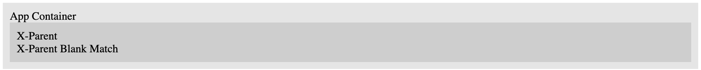
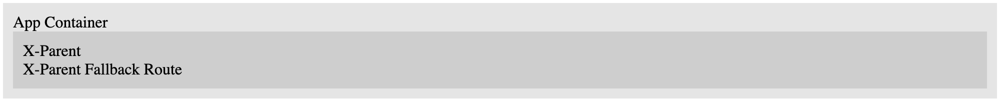
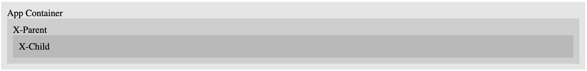
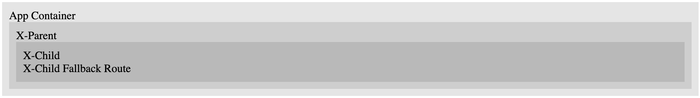
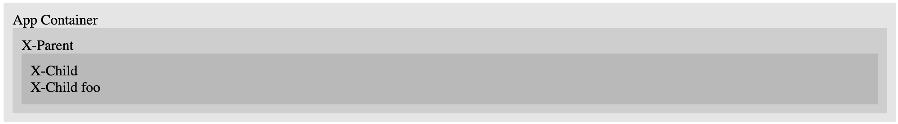

This is a repo demonstrating a (potential) bug with Lit router.

# /

- In `x-parent`, this matches the `path: ''` route and renders `X-Parent Blank Match`. This seems correct.

# /foo

- In `x-parent`, this matches the fallback route and renders `X-Parent Fallback Route`. This seems correct (as there is no matching route defined for `foo` in `x-parent`).

# /some-path (without ending slash)

- In `x-parent`, this matches the `path: 'some-path/*?'` route and renders an `x-child`.
- In `x-child`, this does not render anything. **This seems wrong**. I would expect it to match the `path: ''` route, or, failing that, fall back to the fallback route.

# /some-path/ (with ending slash)

- In `x-parent`, this matches the `path: 'some-path/*?'` route and renders an `x-child`.
- In `x-child`, this matches the `path: ''` route and renders `X-Child Blank Match`. This seems correct.

# /some-path/random-url

- In `x-parent`, this matches the `path: 'some-path/*?'` route and renders an `x-child`.
- In `x-child`, this matches the fallback route and renders `X-Child Fallback Route`. This seems correct.

- In `x-parent`, this matches the `path: 'some-path/*?'` route and renders an `x-child`.
- In `x-child`, this matches the `path: 'child/foo'` route and renders `X-Child foo`. This seems correct.
