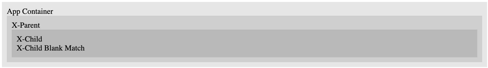

This is a repo demonstrating a (potential) bug with Lit router.

[Discord Context](https://discord.com/channels/1012791295170859069/1040018320797208577/1040406145577267251).

[Github Issue](https://github.com/lit/lit/issues/3453)

# Reproduction

1. git clone https://github.com/keviddles/lit-routing-bug
2. cd lit-routing-bug
3. pnpm install
4. pnpm start
5. Navigate to localhost:5173
6. Click on the link /some-path. Observe no text matching X-Child Blank Match. (It should appear).
7. Click on the link /some-path/. Observe text matching X-Child Blank Match.

# Overview

There are three components:

- `x-app`
- `x-parent`
- `x-child`

`x-app` defines a `Router` and a match-all route (`'/*'`).

`x-parent` defines `Routes` and defines a base `''` route, specific path route (`'some-path/*?'`), and a fallback route. All routes appear to match correctly.

`x-child` defines `Routes` and defines a base `''` route, specific path route (`'child/foo'`), and a fallback route. [The base route **does not seem** to match; this may be a bug](#some-path-without-ending-slash).

# Routes

## /

- In `x-parent`, this matches the `path: ''` route and renders `X-Parent Blank Match`. This seems correct.

## /foo

- In `x-parent`, this matches the fallback route and renders `X-Parent Fallback Route`. This seems correct (as there is no matching route defined for `foo` in `x-parent`).

## /some-path (without ending slash)

- In `x-parent`, this matches the `path: 'some-path/*?'` route and renders an `x-child`.
- In `x-child`, this does not render anything. **This seems wrong**. I would expect it to match the `path: ''` route, or, failing that, fall back to the fallback route.

## /some-path/ (with ending slash)

- In `x-parent`, this matches the `path: 'some-path/*?'` route and renders an `x-child`.
- In `x-child`, this matches the `path: ''` route and renders `X-Child Blank Match`. This seems correct.

## /some-path/random-url

- In `x-parent`, this matches the `path: 'some-path/*?'` route and renders an `x-child`.
- In `x-child`, this matches the fallback route and renders `X-Child Fallback Route`. This seems correct.

- In `x-parent`, this matches the `path: 'some-path/*?'` route and renders an `x-child`.
- In `x-child`, this matches the `path: 'child/foo'` route and renders `X-Child foo`. This seems correct.
